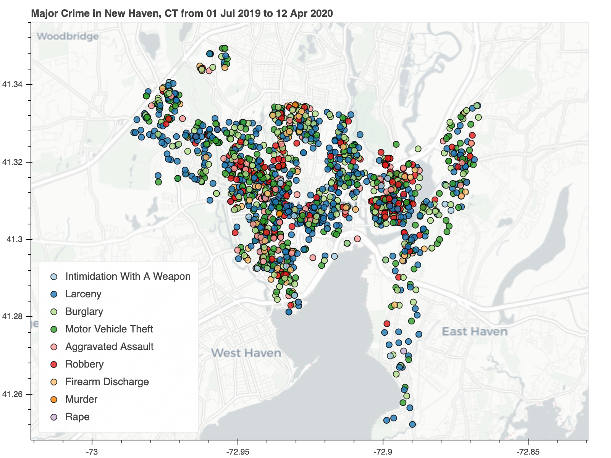

# New Haven Crime Data 

You can explore the New Haven crime data yourself with this [interactive crime map](https://new-haven-crime-data.herokuapp.com/).

---

This repo contains the tools to get and process the crime data in New Haven, CT as provided by the NHPD on their [website](https://www.newhavenct.gov/gov/depts/nhpd/compstat_reports.htm).

1. `raw_data` contains the code to get the raw data (in PDF form)
2. `clean_data` contains the code to parse the PDFs and dump the raw major crime data into a CSV.  
   The "unclean" data is the processed using OpenRefine, and geo-tagged according to the street location.  
   The final, cleaned and geotagged data is in `crime_data_clean.csv`.
3. `explore_data` has some scripts to look at trends in the data (work in progress).
4. `crime_map` contains a script to plot the crime data in New Haven and filter by date. 

